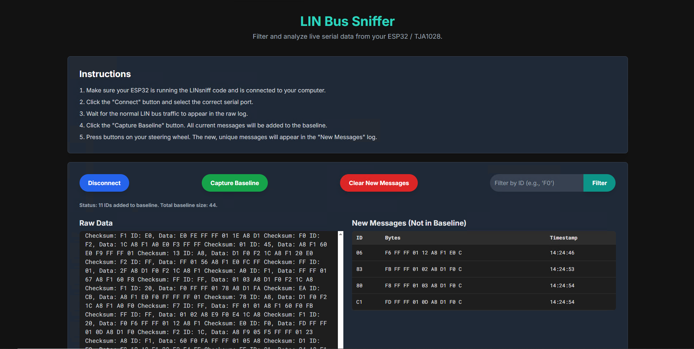
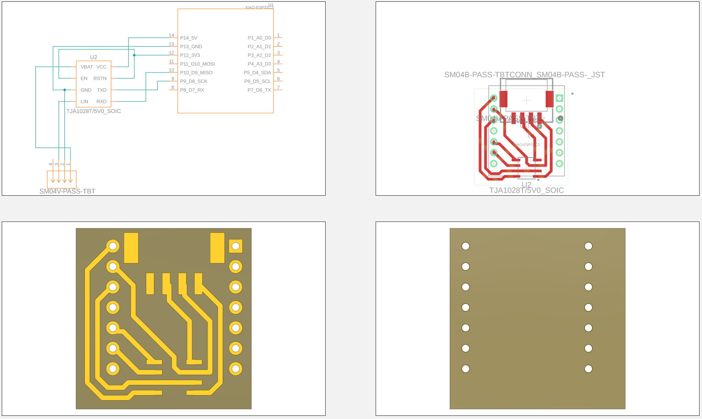

# 🚗 ESP32-C3 LIN Bus Analyzer

This project allows you to **analyze and capture data from a LIN Bus** using an **ESP32-C3** microcontroller and a **Web Serial API-based web app**.  
The ESP32-C3 acts as a bridge, reading incoming bytes from the LIN bus and forwarding them via serial to a browser-based interface.

---

## 🔧 Components Needed

- **[Seeed Studio XIAO ESP32-C3](https://www.digikey.com/en/products/detail/seeed-technology-co-ltd/113991054/16652880)**: A small, low-power microcontroller board (e.g., XIAO ESP32-C3).
- **[TJA1027 (3.3V) LIN Transceiver](https://www.digikey.com/en/products/detail/nxp-usa-inc/TJA1028T-5V0-10-11/2606135)**: Converts the single-wire LIN bus signal to a UART signal.
  - _(Other compatible LIN transceivers may work too.)_

---

## 🧰 Wiring Instructions

Wire the **XIAO ESP32-C3** to the **TJA1027 (3.3V)** LIN transceiver as follows:

| TJA1027 (3.3V) Pin | Connection                       |
|--------------------|----------------------------------|
| Pin 1 (VBAT)       | 12V Source                       |
| Pin 2 (EN)         | XIAO ESP32-C3 **3.3V**           |
| Pin 3 (GND)        | XIAO ESP32-C3 GND                |
| Pin 4 (LIN)        | LIN Bus                          |
| Pin 5 (RXD)        | XIAO ESP32-C3 Pin **D9 (TX)**    |
| Pin 6 (TXD)        | XIAO ESP32-C3 Pin **D8 (RX)**    |
| Pin 7 (RSTN)       | XIAO ESP32-C3 **3.3V**           |
| Pin 8 (VCC)        | XIAO ESP32-C3 **5V**             |

---

## 💻 Microcontroller Setup

### 1. Install Arduino IDE
Download and install from the [official Arduino website](https://www.arduino.cc/en/software).

### 2. Add ESP32 Board Support

- Go to **File > Preferences**.
- In the "Additional Boards Manager URLs", add:
https://raw.githubusercontent.com/espressif/arduino-esp32/gh-pages/package_esp32_index.json

- Then go to **Tools > Board > Boards Manager**.
- Search for **esp32** and install the package by *Espressif Systems*.

### 3. Select the Correct Board

- Go to **Tools > Board > esp32**.
- Choose **XIAO_ESP32C3**.

### 4. Upload the Code

- Open the `linsniff_esp32c3.ino` file.
- Connect your board via USB.
- Click **Upload**.

---

## 🌐 Using the Web Application

Once the board is flashed and wired correctly, follow these steps:

### 1. Save the Web App

- Save the provided HTML code as `linsniff_ESP32.html`.

### 2. Open in a Browser

- Use a modern browser that supports the Web Serial API (e.g., **Google Chrome**).
- Open the `linsniff_ESP32.html` file in the browser.

### 3. Connect to the Device

- Click the **"Connect"** button.
- Select your **XIAO ESP32-C3** from the device list.

### 4. Capture a Baseline

- When the **"All Messages"** log shows a stable stream of messages, click **"Capture Baseline"**.
- This will filter out known traffic, allowing only **new or unknown messages** to show in the "New Messages" log.

### 5. Monitor New Messages

- The **"New Messages"** log displays anything that doesn't match the baseline — great for detecting new commands, updates, or errors.

---

## 📸 Screenshots

